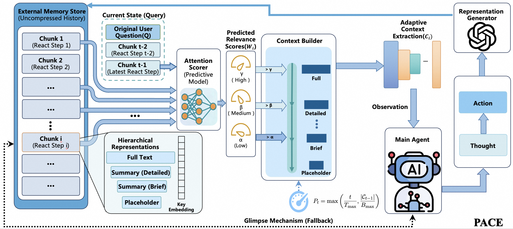
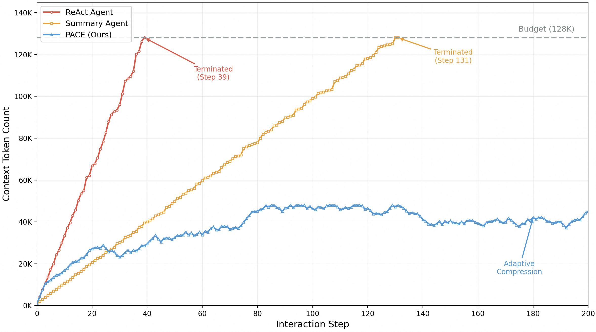

# PACE: Predictive Adaptive Context Extraction for Long-Horizon LLM Agents

Large Language Model (LLM) agents struggle with ultra-long-horizon tasks requiring hundreds or thousands of interaction steps. Traditional context management approaches face a fundamental dilemma: preserving complete histories rapidly exhausts context windows and forces crude truncation, while aggressive summarization discards critical information prematurely. We propose Predictive Adaptive Context Extraction (PACE), a novel framework that reconceptualizes context management as a Next Step Prediction problem. Inspired by neural attention, PACE dynamically constructs context by adjusting historical memory granularity based on its predicted relevance for the next action. Comprehensive evaluation across diverse benchmarks and models demonstrates that PACE consistently improves task success rates, with larger gains on complex tasks and robust cross-lingual performance. Crucially, PACE enables agents to sustain effective reasoning for 4,897 interaction steps in ultra-long-horizon scenarios, achieving a 66.2× improvement over the full-context ReAct baseline and 5.1× over advanced folding baselines. This fundamentally advances the capability of LLM-based agents in previously intractable long-horizon scenarios.

## Contributions

- We introduce PACE, a novel framework that reframes context management as a Next Step Prediction problem, dynamically constructing context through vectorized attention and pressure-adaptive compression based on predicted relevance for the immediate next action.

- We demonstrate comprehensive improvements across six diverse benchmarks and four models of varying scales, including state-of-the-art web agents. PACE achieves larger gains on complex tasks compared to simpler ones, while maintaining robust performance across languages and domains.

- We significantly extend agent operational longevity, achieving 4,897 interaction steps in ultra-long-horizon scenarios, representing a 66.2× improvement over the full-context ReAct baseline and 5.1× over advanced folding baselines.

## PACE 

PACE's architecture comprises five coordinated components. The **Main Agent** is the core decision-maker, receiving the dynamically constructed context Ct to generate actions using a LLM. The **External Memory Store** (M) maintains the complete interaction history: Mt = {Chunk1, ..., Chunkt-1}. The **Representation Generator** utilizes a LLM (e.g., Gemini 2.5 Flash-Lite) to asynchronously produce multi-level summaries for each chunk, avoiding blockage of the main agent loop. The **Attention Scorer** employs a locally-hosted dense retrieval model (e.g., BGE-M3) to predict chunk relevance via semantic similarity. Finally, the **Context Builder** synthesizes relevance scores with adaptive compression policies to assemble Ct within token budget constraints.

Each interaction chunk maintains four representations at different granularity levels:

$$
Chunk_i = \{ id_i, type_i, t_i, R_{full}^{(i)}, R_{detailed}^{(i)}, R_{brief}^{(i)}, R_{ph}^{(i)}, \mathbf{k}_i \}
$$

where **k**i is the pre-computed key embedding. The representations range from complete content (Rfull), a comprehensive summary (Rdetailed), a concise 1-2 sentence summary (Rbrief), to a minimal placeholder (Rph). These multiple granularity levels enable flexible compression adapting to varying relevance scores.

## Predictive Attention with Adaptive Compression

PACE's core innovation treats historical context selection as a next-step prediction problem. Let N denote the number of recent chunks preserved in full detail (we set N=2). Given the user's query Q and the most recent N chunks, we construct their concatenation Rt = Q ⊕ ⊕j=t-Nt-1 Rfull(j). We encode both the query and historical chunks using an embedding model, which produces dense vectors:

$$
\begin{aligned}
\mathbf{q}_t &= Enc(Truncate(R_t, L_{max})) \\
\mathbf{k}_i &= Enc(Truncate(R_{full}^{(i)}, L_{max}))
\end{aligned}
$$

where Lmax is the encoder's maximum input length, and **k**i is the key embedding for each historical chunk Chunki where i ≤ t-N-1. This symmetric truncation strategy ensures both queries and keys fully utilize the encoder's capacity while maintaining balanced semantic representation. Key embeddings are computed once at chunk creation time and cached, enabling efficient retrieval even before detailed summaries are generated asynchronously. The summaries (Rdetailed, Rbrief) are used solely for multi-granularity presentation in the final context.

Let M = t - N - 1 denote the number of chunks requiring scoring. Raw similarity scores are computed via cosine similarity: si = cos(**q**t, **k**i). We then apply softmax with low temperature τ = 0.3 to sharpen the distribution, accentuating relevant chunks while suppressing irrelevant ones:

$$
w_i = \frac{\exp(s_i / \tau)}{\sum_{j=1}^{M} \exp(s_j / \tau)}
$$

To enable adaptive thresholding, we compute relative weights: w̃i = M · wi. A relative weight w̃i > 1 indicates above-average relevance. With low temperature τ, the softmax becomes highly peaked, concentrating weight on top-ranked chunks while driving most w̃i values well below 1, naturally facilitating intensified compression.

**Pressure-Adaptive Thresholds.** A key PACE feature is adapting compression intensity based on interaction state. We define "compression pressure" Pt ∈ [0, 1] reflecting both task progression and context budget utilization:

$$
P_t = \max\left(\frac{t}{T_{max}}, \frac{|C_{t-1}|}{B_{max}}\right)
$$

where Tmax is the expected maximum task length, Bmax is the token budget (set to 128K), and |Ct-1| denotes the previous context's token count. In practice, Tmax is set to the 95th percentile of observed task lengths in each benchmark's validation set, providing a robust estimate without requiring precise horizon knowledge. We initialize |C0| as the system prompt plus query length, ensuring well-defined initial conditions and avoiding circular dependency.

Base thresholds (α0, β0, γ0) = (0.4, 0.8, 1.5) are adjusted dynamically: αt = α0 · (1 + λPt), and similarly for βt and γt, where λ = 0.5 controls adaptation rate. As pressure Pt increases, thresholds rise proportionally, making it progressively harder for chunks to qualify for detailed representations. This pushes more chunks toward brief summaries or placeholders, intensifying compression automatically as context accumulates. The adjusted relative weight w̃i determines the representation level:

$$
Select(Chunk_i) = \begin{cases}
R_{full}^{(i)} & \text{if } \tilde{w}_i > \gamma_t \\
R_{detailed}^{(i)} & \text{if } \beta_t < \tilde{w}_i \leq \gamma_t \\
R_{brief}^{(i)} & \text{if } \alpha_t < \tilde{w}_i \leq \beta_t \\
R_{ph}^{(i)} & \text{if } \tilde{w}_i \leq \alpha_t
\end{cases}
$$

The final context is assembled as:

$$
C_t = Sys \oplus Q \oplus \left(\bigoplus_{i=1}^{M} Sel_i\right) \oplus \left(\bigoplus_{j=t-N}^{t-1} R_{full}^{(j)}\right)
$$

where Sys denotes the system prompt and Seli = Select(Chunki).

## Ultra-Long Horizon Stress Test

PACE with its standard adaptive pressure (λ=0.5) sustained operation for 2,776 steps---a 2.9× improvement in operational longevity over the Folding Agent and a remarkable 37.5× improvement over the full-context ReAct baseline. Even more remarkably, by increasing the adaptation rate for aggressive compression (λ=1.0), PACE extended its operational horizon to 4,897 steps, achieving a 5.1× improvement over Folding Agent and an exceptional 66.2× improvement over ReAct. This result powerfully demonstrates that PACE's predictive, pressure-adaptive mechanism is critical for navigating ultra-long-horizon tasks, enabling agents to maintain coherent reasoning over thousands of interaction steps within a finite, albeit large, context window.

